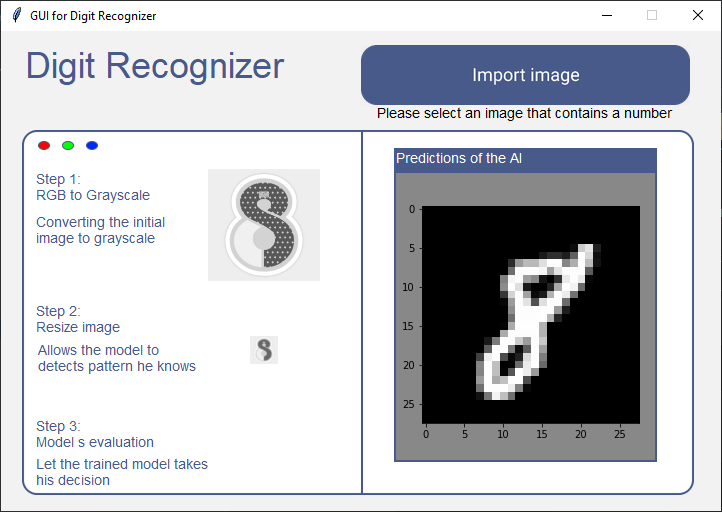

# Digit Recognizer
Simple workaround of digit recognizer and an implementation of digit Generative Adverserial Network using Keras.  
This project includes 4 notebooks (Jupyter) + the application that uses the model from the notebook 04.   
The application is used to predict single number from an image selected by the user, and it shows brievly how the image is pre processed.  

### Notebooks : 
1. `01_digit_prepocess.ipynb`: Preprocessing data to obtains features and labels
2. `02_digit_model.ipynb`: Training the model  
2. `03_digit_GAN.ipynb`: Using GAN to generate fake number  
3. `04_digit_recognizer_extra.ipynb`: Training a new model with single handwritten number which is deployed in the app  (MNSIT dataset)  
&nbsp; 

### The App  
  
Installing Python dependencies with pip: `pip install requirements.txt`
App is partially build with Tkinter-Designer & Figma that allows to create dynamic interface easily. (https://github.com/ParthJadhav/Tkinter-Designer)

## GAN
nb. of epochs |1      | 50 | 100 | 200     
:---: | :---: |  :---: | :---: | :---: | 
preview | |  | | 
  

### Improvements
Upgrade the model to be able to detect multi digit number. To get multi digit number data it's possible to concatenate image and update their labels like there https://github.com/thomalm/svhn-multi-digit/blob/master/03-mnist-synthetic-dataset.ipynb

## Sources
http://ufldl.stanford.edu/housenumbers/ - Data for notebook 01 & 02
https://keras.io/examples/generative/conditional_gan/, https://github.com/Zackory/Keras-MNIST-GAN - GAN implementation for notebook 03
http://yann.lecun.com/exdb/mnist/ - MNSIT dataset for notebook 04